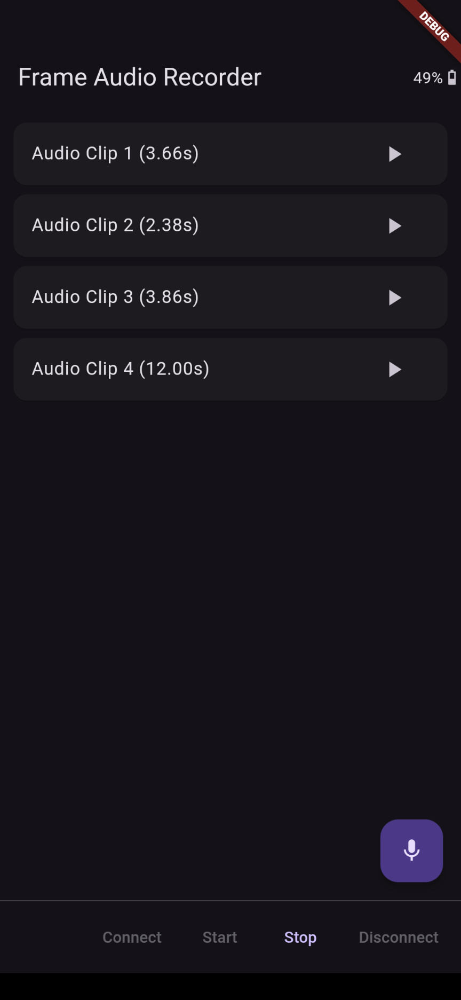

# Frame Audio Clip Recorder

Record streamed audio clips from the Brilliant Labs Frame into a list for review and playback.

Audio is recorded at 8kHz, 16-bit linear PCM and streamed back in real-time so long recordings (that would exceed Frame memory) are possible.

Playback uses the `raw_sound` Flutter package (in fact a fork of the original package due to build/version issues with the original).

Very short clips (< 256ms) can be recorded but won't be played since `raw_sound` doesn't seem to play clips shorter than its buffer size (4096 bytes) on Android, at least.

### Screenshots

### Architecture

